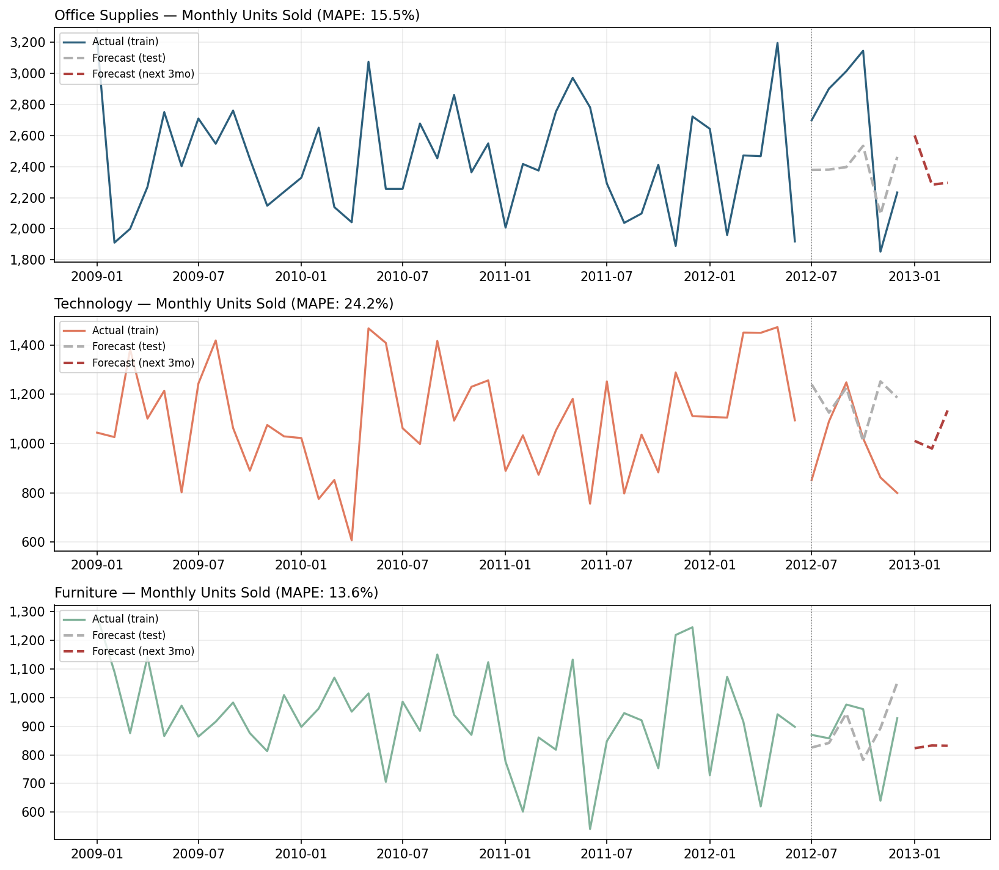
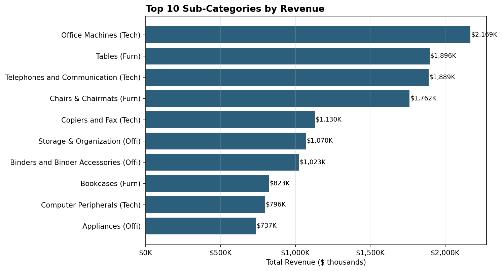
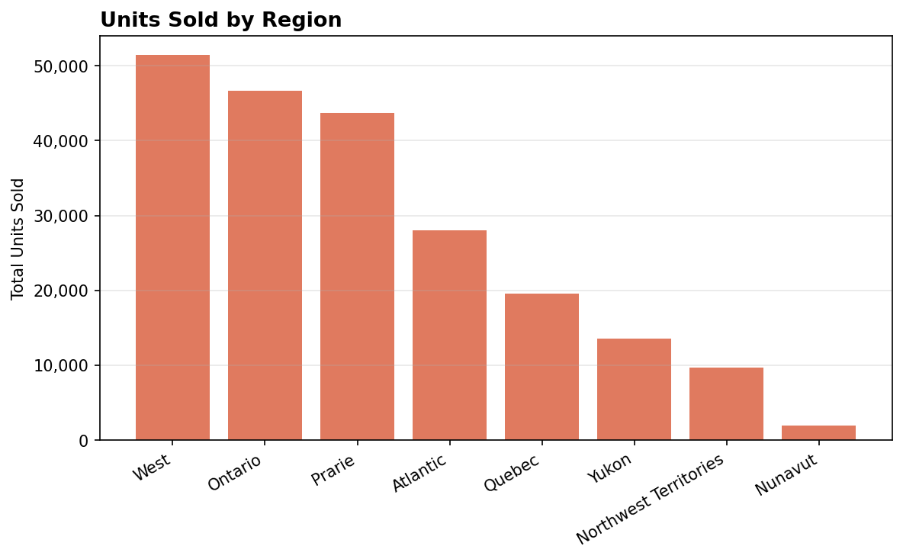

# Retail Demand Forecasting & Inventory Planning

Forecasting monthly product demand across categories to support inventory allocation and reorder planning, using time-series modeling on ~4 years of retail transaction data.

## Business Question
Retail and inventory teams need to know how much of each product category to stock next month — order too little and you stock out, order too much and you tie up cash in inventory. This project builds a monthly demand forecast for each product category and turns it into a concrete reorder recommendation.

## Approach
1. **Clean and aggregate** ~8,400 retail transactions (2009–2012) into monthly unit-demand time series per product category
2. **Forecast** each category's demand using Holt-Winters exponential smoothing (captures trend + seasonality)
3. **Validate** each model on a held-out 6-month test window and report MAPE (Mean Absolute Percentage Error)
4. **Translate** the forecast into a reorder quantity with a 15% safety-stock buffer

## Results

| Category | Avg Monthly Demand | Next 3-Month Forecast | Forecast Accuracy (MAPE) | Recommended Reorder Qty |
|---|---|---|---|---|
| Office Supplies | 2,640 units | 2,599 / 2,283 / 2,295 | 15.5% | 2,752 units |
| Technology | 979 units | 1,011 / 980 / 1,134 | 24.2% | 1,198 units |
| Furniture | 872 units | 823 / 833 / 832 | 13.6% | 954 units |

Furniture and Office Supplies forecast reliably (MAPE under 16%); Technology is noisier (24.2% MAPE), likely driven by lumpier big-ticket purchases (copiers, printers) rather than steady repeat demand — worth flagging to a planning team rather than treating all three categories the same way.



### Where the revenue actually comes from



Office Machines, Tables, and Telephones/Communication are the top 3 sub-categories by revenue — useful for prioritizing which SKUs deserve the tightest forecasting attention.



## Tools
- **Python** (pandas, statsmodels, matplotlib) — data cleaning, Holt-Winters exponential smoothing forecasting model, MAPE validation
- **Excel** — interactive dashboard (`retail_dashboard.xlsx`) with KPI cards, category/region breakdowns, and the forecast + reorder table, built with native charts and formulas

## Repo Structure
```
breakdown.py                  - revenue/region breakdowns, reorder table
build_excel_dashboard.py      - builds the Excel dashboard
forecast.py                   - cleaning, forecasting, evaluation
forecast_layer.csv            - forecast overlay data
forecast_results.json         - forecast + accuracy (MAPE) per category
reorder_recommendations.csv   - forecast-driven reorder quantities
retail_dashboard.xlsx         - Excel dashboard (KPIs, charts, forecast sheet)
superstore_clean.csv          - source data
tableau_ready_data.csv        - long-format export for Tableau/Power BI
*.png                         - output charts
```

## Business Takeaway
A team running on last-month's-actuals instead of a forecast would be planning Office Supplies inventory around ~2,640 units/month when the model shows demand trending down toward ~2,283–2,295 in the next two months — a gap that either ties up unnecessary working capital or, in the other direction, risks a stockout if a category is trending up. The 15% safety-stock buffer on top of the forecast balances that risk without just guessing.

---
*Part of a data analytics portfolio — built to demonstrate demand forecasting and inventory-planning analysis for retail/consumer analyst roles.*
